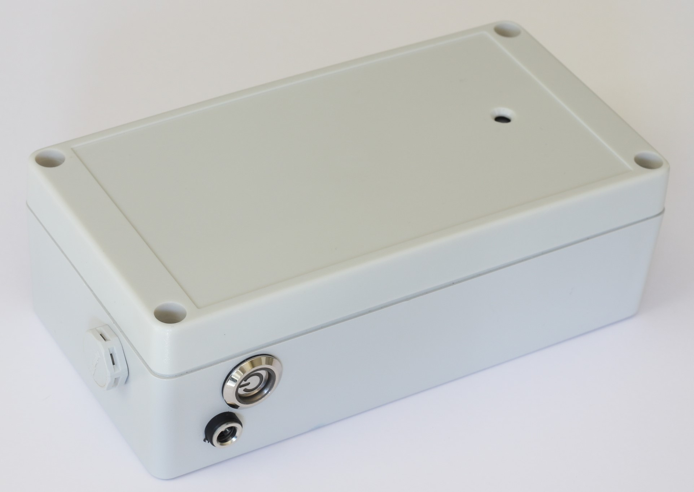
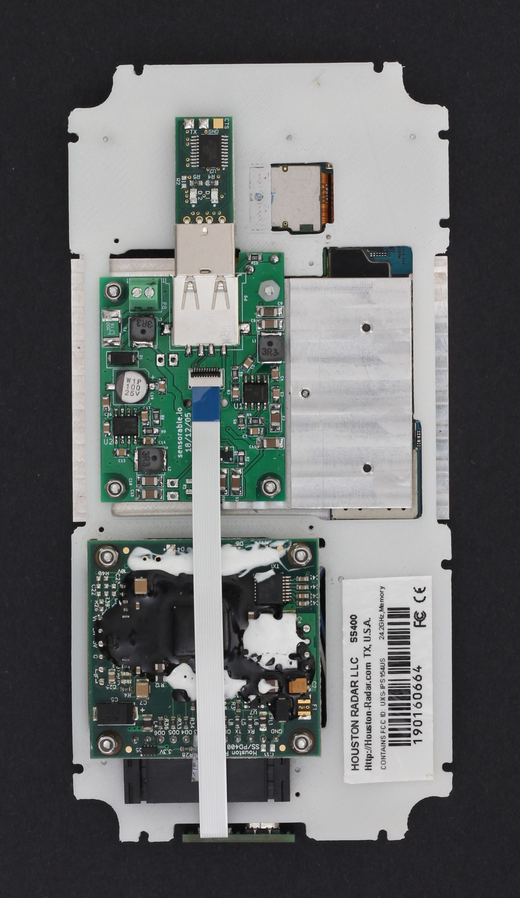
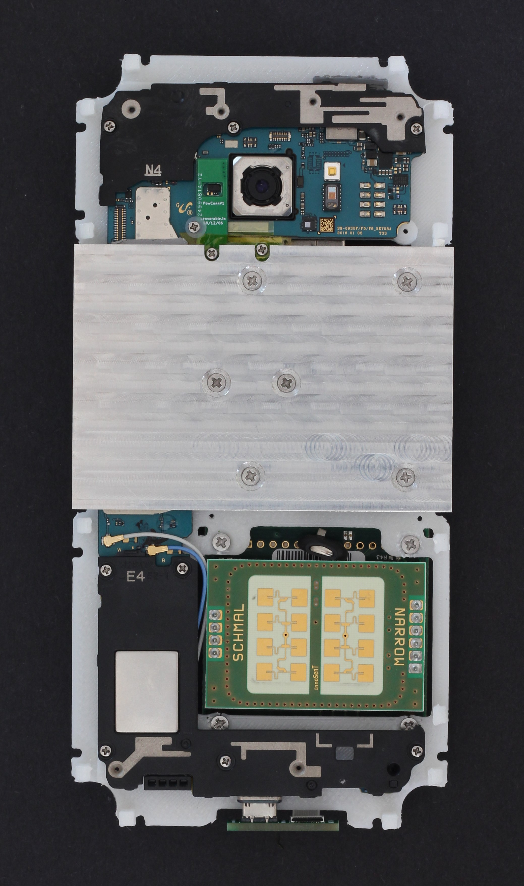
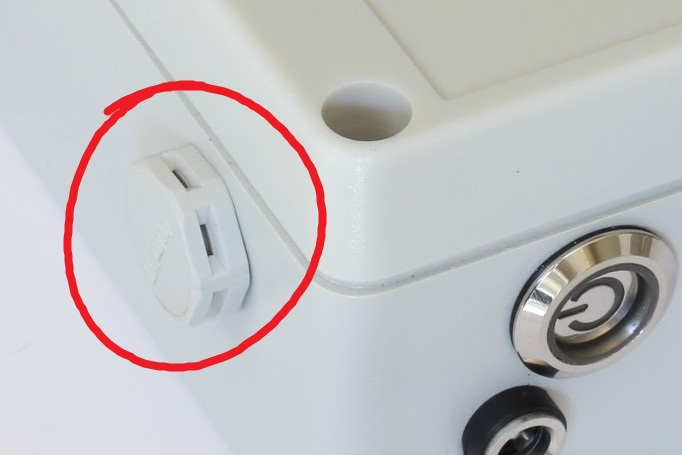
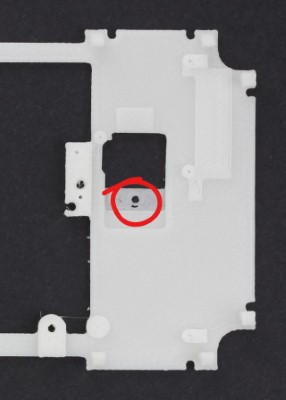

# Sensorable Open Source Camera
### Chassis and Enclosure

This repository contains files for the enclosure, chassis plate and heat sink to fit G935F model of Sensorable Cam inside a waterproof RP1170 box.

Main parts:

* chassis plate - a single 3D-printed ABS plate that holds all the components together
* heat sink - a pair of copper or alluminium blocks that wrap around G935F board

The designs are made in Autocad. We see it as a compromise between accessibility and capability. You can download a copy and run it for a month or two at a small cost while you are making changes. Please, don't forget to commit them back to GitHub.

## Ordering

Ready made parts can be purchased from Sensorable partners, but it is actually very easy to organise your own production run, big or small.

1. See the full BOM in https://github.com/sensorable/g935-electronics
2. Use our ordering templates from *ordering-templates.md* file to give the right instructions to the manufacturers

## Assembly Instructions

1. Check the chassis for visual defects
2. Scrape any printing artifacts
3. Make sure it fits in the box without bending
4. Re-drill 1mm holes for screws
5. Re-drill 2mm holes for PSU contacts
6. Refresh countersinks for PSU contacts
7. Refresh countersinks for radar screws
8. Place the radar screws in and fix them with nuts on the other side

## Breathable Vent Installation

The vent is needed if you use both parts of RP1170 enclosure making it a watertight unit. The actual location of the vent makes no difference. Place it where it doesn't get in the way during the installation. Vent details: http://www.amphenolltw.com/2012download/2D%20PDF/18_Vent%20Connectors/VENT-PS1XXX-XXXXX.pdf

#### Option 1 - using a nut

The vent comes with an M12 x 1.5 nut. 
* drill a 12 mm hole
* deburr
* insert the vent
* tighten the nut
* check that the seal on the outside is evenly distributed
* undo and deburr some more if there is a problem with the seal

#### Option 1 - screwing directly into the wall

This is an option you have to take if the vent should be flush with the intenal surface of the wall, e.g. you are placing a battery pack in there.

* drill a 10 mm hole
* deburr
* cut a 12 x 1.5mm thread in the wall
* place a small thin SS washer between the head of vent and the seal (11-16 x 0.5)
* carefully tighten the vent so that the seal on the outside is evenly distributed
* undo and repeat some more if there is a problem with the seal
* cut the excess of the vent for a flush fit

## Camera Hole

The chassis plate contains a 2mm hole in the center of the camera area. Use it to mark the hole for the camera in the front part of the enclosure. Double-check that the hole is centered on one axis.

Use a 5mm drill bit.

Add a counter-sink on the outside of the case to let the water shed. Otherwise it will pool in the corners obscuring the view.

