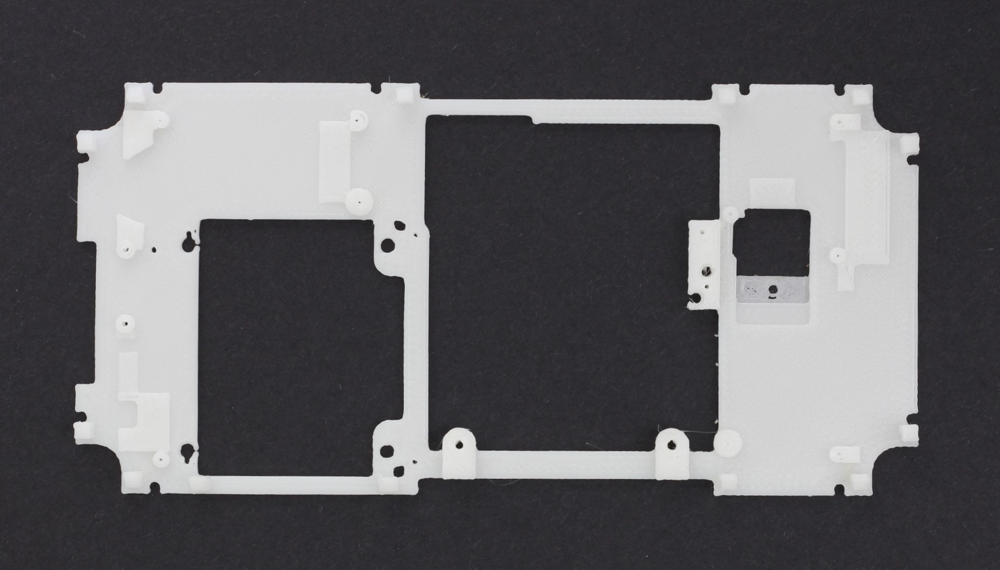

# Sensorable Open Source Camera
### Ordering templates

## G935F Chassis Plate

Use this template to place an order for one or more plates. It contains the parameters you need to consider to get the right product.
You can adjust any of the parameters to fit your needs. E.g. made the print lighter, change colour, etc.
----

1. Qty: 3 min or as many as you can fit on the plate
2. Additive process: FDM
3. Colour: any
4. Material: ABS+
5. Infill: 100%
6. Layer: 250micron
7. Finish: natural, no smoothing or post-processing is required

This is what a plate usually looks like before finishing

